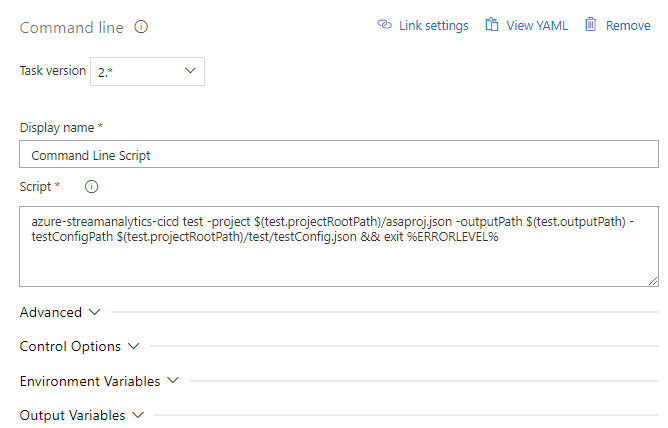

# Continuously integrate and develop with Stream Analytics CI/CD npm package
You can use the Azure Stream Analytics CI/CD npm package to set up a continuous integration and deployment process for your Stream Analytics jobs. This article describes how to use the npm package in general with any CI/CD system, as well as specific instructions for deployment with Azure Pipelines.

## How to install
```
npm install -g azure-streamanalytics-cicd-1.0.9-preview.tgz
```

To use the package in a pipeline, you need to upload the package file before installing it [globally](https://docs.npmjs.com/downloading-and-installing-packages-globally) via the `npm install -g azure-streamanalytics-cicd-1.0.9-preview.tgz` command, as the package hasn't been released yet. This is the recommended approach, which can also be used in a PowerShell or Azure CLI script task of a build pipeline in **Azure Pipelines**.

## How to use CI
### Build
Use the following command to generate the Azure Resource Manager templates. The command is the same for Visual Studio Code and Visual Studio Project.

```powershell
azure-streamanalytics-cicd build -project <projectFullPath> [-outputPath <outputPath>]
```

| Parameter | Description |
|---|---|
| project | The path of the **asaproj.json** file for your Visual Studio Code project or **[Your project name].asaproj** for Visual Studio project. |
| outputPath | The path of the output folder. If it is not specified, the templates will be placed in the current directory. |

Example:

VS Code project test
```powershell
azure-streamanalytics-cicd build -project "/Users/roger/projects/samplejob/asaproj.json"
```

Visual Studio project
```powershell
azure-streamanalytics-cicd build -project "/Users/roger/projects/samplejob/samplejob.asaproj"
```

When a Stream Analytics project builds successfully, it generates the following two Azure Resource Manager template files under the output folder:

*  Resource Manager template file

       [ProjectName].JobTemplate.json

*  Resource Manager parameters file

       [ProjectName].JobTemplate.parameters.json

The default parameters in the parameters.json file are from the settings in your Visual Studio Code or Visual Studio project. If you want to deploy to another environment, replace the parameters accordingly.

> [!NOTE]
> For all the credentials, the default values are set to null. You are **required** to set the values before you deploy to the cloud.

```json
"Input_EntryStream_sharedAccessPolicyKey": {
      "value": null
    },
```
Learn more about how to [deploy with a Resource Manager template file and Azure PowerShell](https://docs.microsoft.com/azure/azure-resource-manager/resource-group-template-deploy). Learn more about how to [use an object as a parameter in a Resource Manager template](https://docs.microsoft.com/azure/architecture/building-blocks/extending-templates/objects-as-parameters).

To use Managed Identity for Azure Data Lake Store Gen1 as output sink, you need to provide Access to the service principal using PowerShell before deploying to Azure. Learn more about how to [deploy ADLS Gen1 with Managed Identity with Resource Manager template](stream-analytics-managed-identities-adls.md#resource-manager-template-deployment).

### Local Run
If your project has specified local input files, you can run a Stream Analytics script locally by using the localrun command.

```powershell
azure-streamanalytics-cicd localrun -project <projectFullPath> [-outputPath <outputPath>] [-customCodeZipFilePath <zipFilePath>]
```

| Parameter | Description |
|---|---|
| project | The path of the **asaproj.json** file for your Visual Studio Code project or **[Your project name].asaproj** for Visual Studio project. |
| outputPath | The path of the output folder. If it is not specified, the output result files will be placed in the current directory. |
| customCodeZipFilePath | The path of the zip file for custom code (UDF, deserializer, etc). |

Example:

VS Code project
```powershell
azure-streamanalytics-cicd localrun -project "/Users/roger/projects/samplejob/asaproj.json"
```

Visual Studio project
```powershell
azure-streamanalytics-cicd localrun -project "/Users/roger/projects/samplejob/samplejob.asaproj"
```

### Unit test
#### Add test case
The unit test cases are described in a test configuration file.
To add a test case template into a test configuration file, run the following command. If the test configuration file doesn't exist, a default one will be created.

```powershell
azure-streamanalytics-cicd addtestcase -project <projectFullPath> [-testConfigPath <testConfigFileFullPath>]
```

| Parameter | Description |
|---|---|
| project | The path of the **asaproj.json** file for your Visual Studio Code project or **[Your project name].asaproj** for Visual Studio project. |
| testConfigPath | The path of the test configuration file. If it is not specified, the file will be searched in **\test** under the current directory of the **asaproj.json** file, with default file name **testConfig.json**. A new file will be created if not existed. |

Example:

VS Code project
```powershell
azure-streamanalytics-cicd addtestcase -project "/Users/roger/projects/samplejob/asaproj.json"
```

Visual Studio project
```powershell
azure-streamanalytics-cicd addtestcase -project "/Users/roger/projects/samplejob/samplejob.asaproj"
```

If the test configuration file is empty, the following content will be written into the file. Otherwise, a test case will be added into the array of **TestCases**. Necessary input configurations are auto filled in according to the input configuration files if they exist. Otherwise, they are configured with default values. **FilePath** of each input and expected output must be specified before running the test. You can modify the configuration manually.

Set **Required** of an expected output to false if it is not required to be checked.

*  testConfig.json
```json
{
  "Script": "",
  "TestCases": [
    {
      "Name": "Case 1",
      "Inputs": [
        {
          "InputAlias": [Input alias string],
          "Type": "Data Stream",
          "Format": "JSON",
          "FilePath": [Required],
          "SerializationDllPath": null,
          "SerializationClassName": null,
          "SerializationDllPathInLocal": null,
          "Sample": null,
          "ScriptType": "InputMock"
        }
      ],
      "ExpectedOutputs": [
        {
          "OutputAlias": [Output alias string],
          "FilePath": "Required",
          "Required": true
        }
      ]
    }
  ]
}
```
### Run unit test
To run multiple test cases for your project, use the following command. A summary of test result will be placed in the output folder. The process exits with code **0** for all tests passed; **-1** for exception occurred; **-2** for tests failed.


```powershell
azure-streamanalytics-cicd test -project <projectFullPath> [-testConfigPath <testConfigFileFullPath>] [-outputPath <outputPath>] [-customCodeZipFilePath <zipFilePath>]
```

| Parameter | Description |
|---|---|
| project | The path of the **asaproj.json** file for your Visual Studio Code project or **[Your project name].asaproj** for Visual Studio project. |
| testConfigPath | The path to the test configuration file. If it is not specified, the file will be searched in **\test** under the current directory of the **asaproj.json** file, with default file name **testConfig.json**.
| outputPath | The path of the output folder. If it is not specified, the output result files will be placed in the current directory. |
| customCodeZipFilePath | The path of the zip file for custom code (UDF, deserializer, etc). |


When all tests are finished, it generates a summary of test results in JSON format into the output folder, named **testResultSummary.json**.

*  testResultSummary.json

```json
{
  "Total": (integer) total_number_of_test_cases,
  "Passed": (integer) number_of_passed_test_cases,
  "Failed": (integer) number_of_failed_test_cases,
  "Script": (string) absolute_path_to_asaql_file,
  "Results": [ (array) detailed_results_of_test_cases
    {
      "Name": (string) name_of_test_case,
      "Status": (integer) 0(passed)_or_1(failed),
      "Time": (string) time_span_of_running_test_case,
      "OutputMatched": [ (array) records_of_actual_outputs_equal_to_expected_outputs
        {
          "OutputAlias": (string) output_alias,
          "ExpectedOutput": (string) path_to_the_expected_output_file,
          "Output": (string) path_to_the_actual_output_file
        }
      ],
      "OutputNotEqual": [ (array) records_of_actual_outputs_not_equal_to_expected_outputs
        {
          "OutputAlias": (string) output_alias,
          "ExpectedOutput": (string) path_to_the_expected_output_file,
          "Output": (string) path_to_the_actual_output_file
        }
      ],
      "OutputMissing": [ (array) records_of_actual_outputs_missing
        {
          "OutputAlias": (string) output_alias,
          "ExpectedOutput": (string) path_to_the_expected_output_file,
          "Output": ""
        }
      ],
      "OutputUnexpected": [ (array) records_of_actual_outputs_unexpected
        {
          "OutputAlias": (string) output_alias,
          "ExpectedOutput": "",
          "Output": (string) path_to_the_actual_output_file
        }
      ],
      "OutputUnrequired": [ (array) records_of_actual_outputs_unrequired_to_be_checked
        {
          "OutputAlias": (string) output_alias,
          "ExpectedOutput": (string) path_to_the_expected_output_file,
          "Output": (string) path_to_the_actual_output_file
        }
      ]
    }
  ],
  "Time": (string) time_span_of_running_all_test_cases,
}
```

## Unit Test with Azure Pipelines

This section introduces how to setup [Azure Pipelines](https://docs.microsoft.com/azure/devops/pipelines/get-started-designer?view=vsts&tabs=new-nav) for Cloud Unit Test.

Open a web browser and navigate to your Azure Stream Analytics project.

1. Under **Pipelines** in the left navigation menu, select **Builds**. Then select **New pipeline**

   

2. Select **Use the classic editor** to create a pipeline without YAML.

3. Select your source type, team project, and repository. Then select **Continue**.

   

4. On the **Choose a template** page, select **Empty job**.

### Add npm task

1. On the **Tasks** page, select the plus sign next to **Agent job 1**. Enter "npm" in the task search and select **npm**.

   

2. Give the task a **Display name**. Change the **Command** option to *custom* and enter the following command in **Command and arguments**. Leave the remaining default options.

   ```cmd
   install -g azure-streamanalytics-cicd-1.0.9-preview.tgz
   ```

   

### Add command line task

1. On the **Variables** page, click **+ Add** in **Pipeline variables** pane. Add the following variables. Modify the values with your output path and repository name.

   |Name|Value|
   |-|-|
   |test.outputPath|TestResult|
   |test.projectRootPath|myASAProject|

   

2. On the **Tasks** page, select the plus sign next to **Agent job 1**. Search for **Command line**.

3. Give the task a **Display name** and enter the following script. Modify the script with your project file name and the path to the test configuration file. In non-windows environment, you need to replace `%ERRORLEVEL%` with `$?`.

   ```cmd
   azure-streamanalytics-cicd test -project $(test.projectRootPath)/asaproj.json -outputPath $(test.outputPath) -testConfigPath $(test.projectRootPath)/test/testConfig.json && exit %ERRORLEVEL%
   ```

   

### Add copy files task

1. On the **Tasks** page, select the plus sign next to **Agent job 1**. Search for **Copy files**. Then enter the following configurations. By assigning `**` to **Contents**, all files of testing results are copied.

   |Parameter|Input|
   |-|-|
   |Display name|Copy Files to: $(build.artifactstagingdirectory)|
   |Source Folder|`$(system.defaultworkingdirectory)/$(test.outputPath)`|
   |Contents| `**` |
   |Target Folder| `$(build.artifactstagingdirectory)`|

2. Expand **Control Options". Select **Even if a previous task has failed, unless the build was canceled** in **Run this task**.

   

### Add Publish build artifacts task

1. On the **Tasks** page, select the plus sign next to **Agent job 1**. Search for **Publish build artifacts** and select the option with the black arrow icon.

2. Expand **Control Options". Select **Even if a previous task has failed, unless the build was canceled** in **Run this task**.

   

### Save and run

Once you have finished adding the npm, command line, copy files, and publish build artifacts tasks, select **Save & queue**. When you are prompted, enter a save comment and select **Save and run**. You can download the testing results from **Summary** page of the pipeline.

## Deploy with Azure Pipelines

This section details how to create Azure Pipelines [build](https://docs.microsoft.com/azure/devops/pipelines/get-started-designer?view=vsts&tabs=new-nav) and [release](https://docs.microsoft.com/azure/devops/pipelines/release/define-multistage-release-process?view=vsts) pipelines using npm. For more information about deploying with Powershell, see [deploy with a Resource Manager template file and Azure PowerShell](https://docs.microsoft.com/azure/azure-resource-manager/resource-group-template-deploy). You can also learn more about how to [use an object as a parameter in a Resource Manager template](https://docs.microsoft.com/azure/architecture/building-blocks/extending-templates/objects-as-parameters).

Open a web browser and navigate to your Azure Stream Analytics project. Follow the same steps in [Unit Test with Azure Pipelines](#unit-test-with-azure-pipelines)to add a new pipeline.

### <a name="Add-npm-task-2">Add npm task</a>

Follow the same steps in [Unit Test with Azure Pipelines](#add-npm-task) to add a custom npm task that install the package globally.

### Add command line task

1. On the **Variables** page, click **+ Add** in **Pipeline variables** pane. Add the following variables. Modify the values with your output path and repository name.

   |Name|Value|
   |-|-|
   |deploy.outputPath|Deploy|
   |deploy.projectRootPath|myASAProject|

   

2. On the **Tasks** page, select the plus sign next to **Agent job 1**. Search for **Command line**.

3. Give the task a **Display name** and enter the following script.

   ```cmd
   azure-streamanalytics-cicd build -project $(deploy.projectRootPath)/asaproj.json -outputPath $(deploy.outputPath)
   ```

   

### Add copy files task

1. On the **Tasks** page, select the plus sign next to **Agent job 1**. Search for **Copy files**. Then enter the following configurations.

   |Parameter|Input|
   |-|-|
   |Display name|Copy Files to: $(build.artifactstagingdirectory)|
   |Source Folder|`$(system.defaultworkingdirectory)/$(deploy.outputPath)`|
   |Contents| `**` |
   |Target Folder| `$(build.artifactstagingdirectory)`|

   

### Add Publish build artifacts task

1. On the **Tasks** page, select the plus sign next to **Agent job 1**. Search for **Publish build artifacts** and select the option with the black arrow icon.

2. Do not change any of the default configurations.

### Save and run

Once you have finished adding the npm, command line, copy files, and publish build artifacts tasks, select **Save & queue**. When you are prompted, enter a save comment and select **Save and run**.

## Release with Azure Pipelines

Open a web browser and navigate to your Azure Stream Analytics Visual Studio Code project.

1. Under **Pipelines** in the left navigation menu, select **Releases**. Then select **New pipeline**.

2. Select **start with an Empty job**.

3. In the **Artifacts** box, select **+ Add an artifact**. Under **Source**, select the build pipeline you just created and select **Add**.

   

4. Change the name of **Stage 1** to **Deploy job to test environment**.

5. Add a new stage and name it **Deploy job to production environment**.

### Add tasks

1. From the tasks dropdown, select **Deploy job to test environment**.

2. Select the **+** next to **Agent job** and search for **ARM template deployment
**. Enter the following parameters:

   |Setting|Value|
   |-|-|
   |Display name| *Deploy myASAProject*|
   |Azure subscription| Choose your subscription.|
   |Action| *Create or update resource group*|
   |Resource group| Choose a name for the test resource group that will contain your Stream Analytics job.|
   |Location|Choose the location of your test resource group.|
   |Template location| *Linked artifact*|
   |Template| $(System.DefaultWorkingDirectory)/_azure-streamanalytics-cicd-demo-CI-Deploy/drop/myASAProject.JobTemplate.json |
   |Template parameters|$(System.DefaultWorkingDirectory)/_azure-streamanalytics-cicd-demo-CI-Deploy/drop/myASAProject.JobTemplate.parameters.json |
   |Override template parameters|-<arm_template_parameter> "your value"|
   |Deployment mode|Incremental|

3. From the tasks dropdown, select **Deploy job to production environment**.

4. Select the **+** next to **Agent job** and search for *ARM template deployment
*. Enter the following parameters:

   |Setting|Value|
   |-|-|
   |Display name| *Deploy myASAProject*|
   |Azure subscription| Choose your subscription.|
   |Action| *Create or update resource group*|
   |Resource group| Choose a name for the production resource group that will contain your Stream Analytics job.|
   |Location|Choose the location of your production resource group.|
   |Template location| *Linked artifact*|
   |Template| $(System.DefaultWorkingDirectory)/_azure-streamanalytics-cicd-demo-CI-Deploy/drop/myASAProject.JobTemplate.json |
   |Template parameters|$(System.DefaultWorkingDirectory)/_azure-streamanalytics-cicd-demo-CI-Deploy/drop/myASAProject.JobTemplate.parameters.json |
   |Override template parameters|-<arm_template_parameter> "your value"|
   |Deployment mode|Incremental|

### Create release

To create a release, select **Create release** in the top right corner.


## Additional resources

To use Managed Identity for Azure Data Lake Store Gen1 as output sink, you need to provide Access to the service principal using PowerShell before deploying to Azure. Learn more about how to [deploy ADLS Gen1 with Managed Identity with Resource Manager template](stream-analytics-managed-identities-adls.md#resource-manager-template-deployment).
